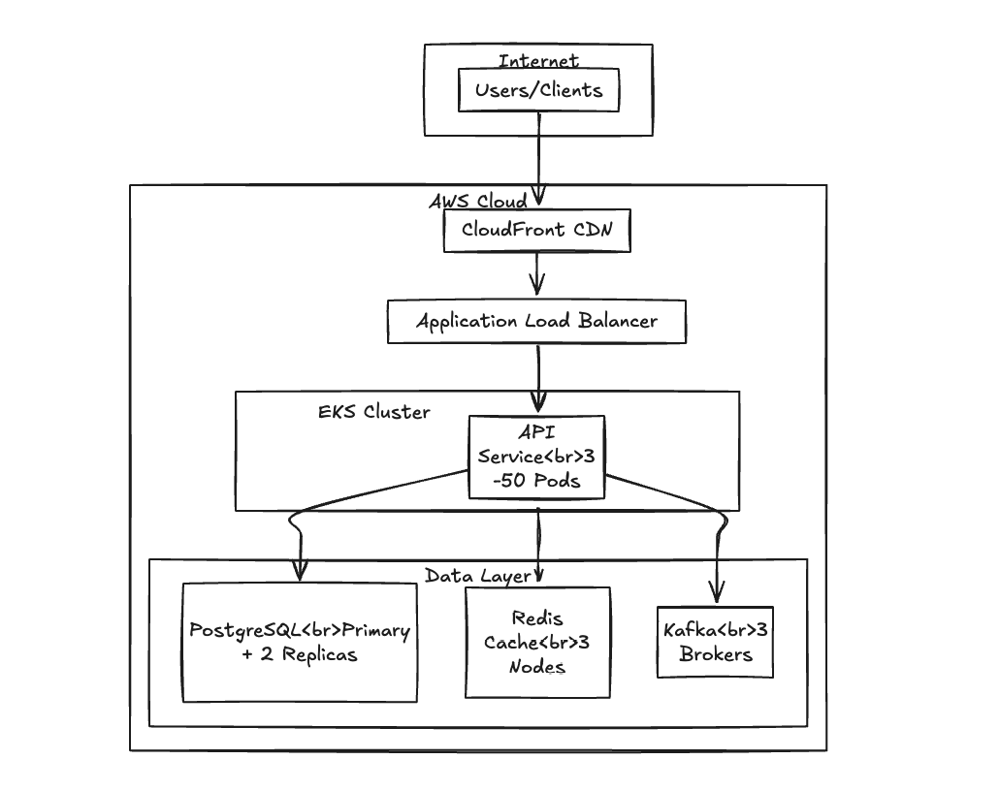
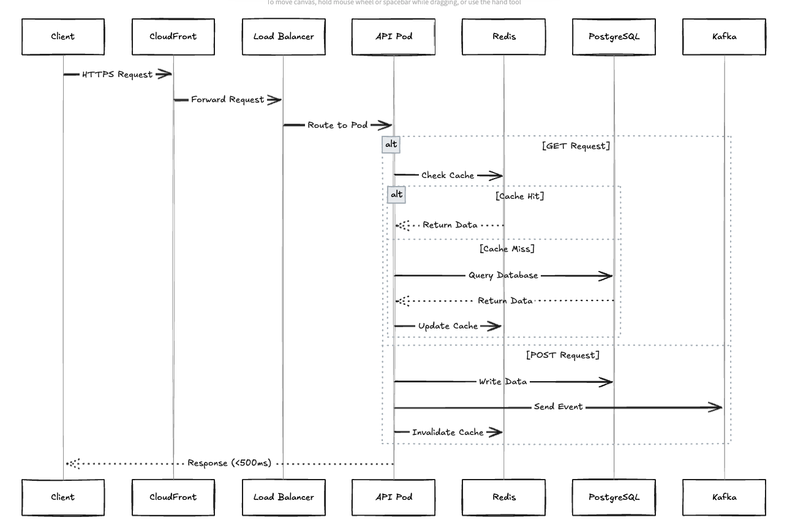
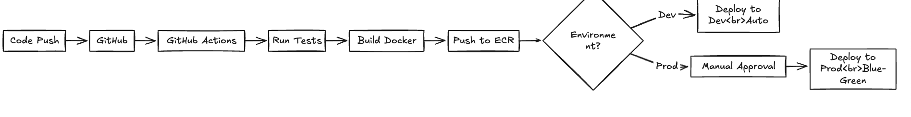
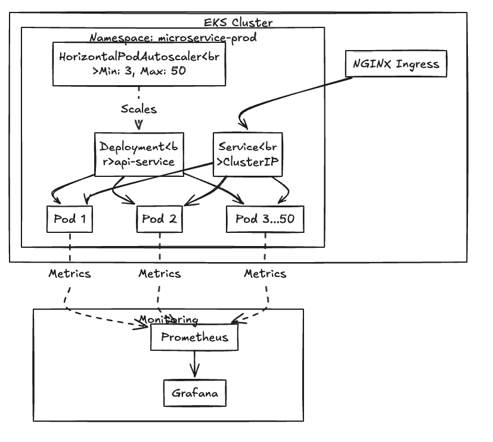

# Data Microservice – Architecture & Design

## Overview

This repository contains the design documentation of a **scalable and maintainable microservice** capable of handling **billions of records** with **P99 response times under 500ms**.  

The project emphasizes **design, architecture, and deployment strategy**. All technology choices are justified with trade-offs.

---

## Features

- **POST /data** – Accept JSON input, validate schema, persist into database  
- **GET /data** – Retrieve and return stored records  
- **Performance** – P99 < 500ms  
- **Scalability** – Billions of rows with <10% degradation  
- **Reliability** – Multi-AZ deployment with high availability guarantees  

---

## System Architecture

The service is designed using a **layered architecture**.  

### High-Level System View


**Layers:**
- **API Layer** – Handles requests, validation, and responses  
- **Service Layer** – Encapsulates business logic and caching logic  
- **Data Layer** – PostgreSQL (with TimescaleDB) for persistence, Redis for caching, Kafka for async processing  

---

## Request Flow



**Typical flow:**
1. Client request enters through **CloudFront** + **WAF**  
2. Routed to **Application Load Balancer (ALB)**  
3. Forwarded to **NGINX Ingress** inside EKS cluster  
4. Request served by API Pod → Service Layer → Database/Cache  
5. Async events published to **Kafka** for further processing  

---

## Deployment Architecture



- **AWS CloudFront + WAF** – global CDN and DDoS protection  
- **ALB** – L7 load balancing with SSL termination and WebSocket support  
- **EKS Cluster** – Kubernetes-managed workloads, running across 3 AZs  
- **Managed Data Services** – RDS PostgreSQL, ElastiCache Redis, MSK (Kafka)  
- **S3** – for backups, logs, and cold data  

---

## Kubernetes Architecture



- **Cluster**: EKS with 3 worker nodes (c5.2xlarge), one per AZ  
- **Pods**: 256MB memory request / 512MB limit, 250m CPU request / 500m limit  
- **HPA Scaling**: 3–50 pods, scaling at 70% CPU threshold  
- **Istio Service Mesh**: automatic mTLS, observability, traffic management  

---

## Technology Choices & Trade-offs

| Component       | Selected Technology       | Alternatives Considered   | Trade-offs & Rationale |
|-----------------|---------------------------|---------------------------|-------------------------|
| Database        | PostgreSQL + TimescaleDB  | MongoDB, DynamoDB         | PostgreSQL offers **ACID compliance**, mature SQL ecosystem, and partitioning. MongoDB is flexible but weaker for joins/transactions. DynamoDB scales automatically but is eventually consistent and costly at scale. |
| Cache           | Redis Cluster             | Memcached                 | Redis provides **sub-ms latency** and **advanced data structures**. Memcached is faster for pure KV but lacks persistence and clustering. |
| Message Broker  | Kafka (MSK)               | RabbitMQ, SQS             | Kafka supports **2M+ msgs/sec** with durability and replay. RabbitMQ is easier but peaks ~50k msgs/sec. SQS is fully managed but not streaming. |
| Container Base  | Alpine Linux              | Distroless                | Alpine is lightweight (<5MB) yet includes debugging tools. Distroless reduces attack surface but harder to debug in production. |
| Orchestration   | Kubernetes (EKS)          | ECS, Nomad                | Kubernetes is the **industry standard** with broad ecosystem support. ECS is simpler but AWS-specific. Nomad is lightweight but less adopted. |
| Service Mesh    | Istio                     | Linkerd                   | Istio provides **richer traffic management + observability**, at cost of 1–2ms overhead. Linkerd is faster/simpler but limited features. |
| Monitoring      | Prometheus + Grafana      | DataDog, CloudWatch       | Prometheus is cost-efficient and customizable. DataDog is feature-rich but ~$750/month more expensive. CloudWatch is tightly integrated but limited. |

---

## Containerization

- **Multi-stage Docker builds** keep production images under 20MB  
- **Docker Compose** replicates production dependencies (PostgreSQL, Redis, Kafka) in local dev  
- **Amazon ECR** used for image storage and vulnerability scanning  

---

## Deployment (AWS EKS)

- **Cluster**: 3 nodes (c5.2xlarge) across AZs  
- **Scaling**: HPA from 3 to 50 pods, tuned for CPU thresholds  
- **Traffic flow**:  
```

CloudFront → WAF → ALB → NGINX Ingress → Pods

```

Resilience: Multi-AZ, rolling deployments, liveness/readiness probes.

---

## CI/CD Pipeline

- **GitHub Actions** automates:
- Linting & formatting  
- Unit & integration tests  
- Docker build & push to ECR  
- Kubernetes deploy (kubectl apply)  

---

## Testing Strategy

- **Unit tests**: schema validation, persistence, service layer  
- **Integration tests**: API + DB interactions  
- **Performance tests**: sustained 10k RPS, P99 <500ms  
- **Future**: Chaos engineering, soak testing  

---

## Observability

- **Prometheus + Grafana** – metrics (scraped every 30s, retained 15 days)  
- **ELK stack** – JSON structured logs (7d hot, 30d warm, 1y cold)  
- **Jaeger** – tracing (1% sampling, 7-day retention)  

---

## Cost Breakdown (AWS)

- Compute (EKS): ~$1,100/month  
- Database (RDS PostgreSQL): ~$3,200/month  
- Cache (Redis ElastiCache): ~$450/month  
- Kafka (MSK): ~$600/month  
- Storage & Monitoring: ~$350/month  
- **Total**: ~$5,700/month  

---

## Roadmap

- Multi-region active-active setup with AWS Global Accelerator  
- Database sharding for workloads beyond 10TB  
- Spot instances to reduce compute costs (up to 70%)  
- Aurora Serverless v2 evaluation for DB auto-scaling  
- GraphQL API for more flexible querying  

---

## Conclusion

This design balances **performance, scalability, and cost**. By leveraging **AWS managed services, Kubernetes, and proven open-source tooling**, the microservice can reliably serve **billions of records** while maintaining strict SLAs and operational efficiency.
